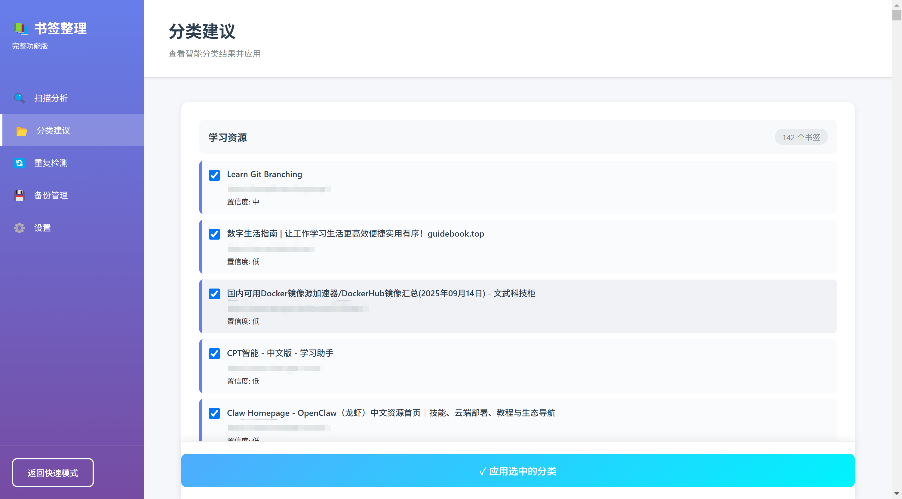
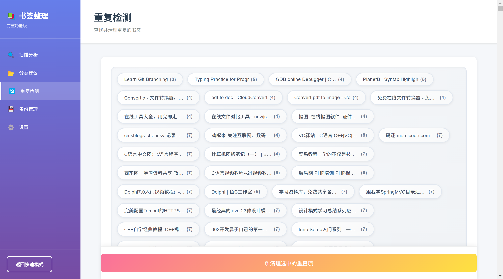
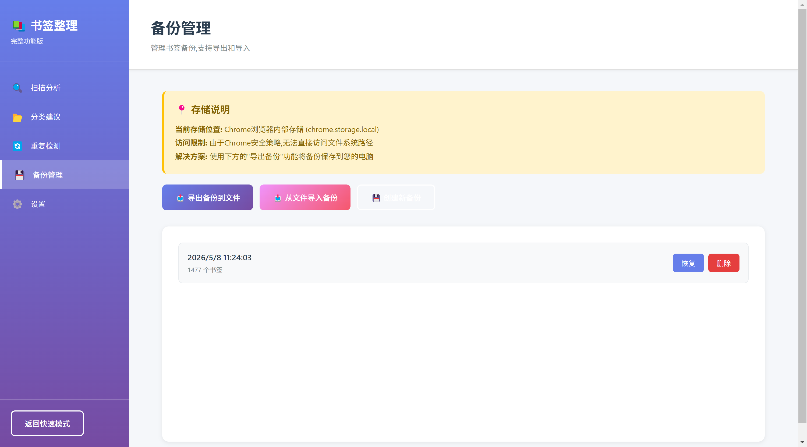

# Bookmark Organizer

[English](README.md) | [中文](README.zh-CN.md) | **Español** | [日本語](README.ja.md) | [Deutsch](README.de.md)

Dejar que los marcadores del navegador se acumulan es doloroso. Después de acumular cientos de ellos, encontrar cualquier cosa requiere búsquedas, y la barra de favoritos se vuelve inútil. Esta extensión está diseñada para resolver ese problema.

Bookmark Organizer es una extensión de navegador que clasifica automáticamente los marcadores desordenados en categorías, encuentra duplicados y crea copias de seguridad antes de cualquier cambio, para que puedas restaurar con un solo clic si algo sale mal. Todo el procesamiento de datos se realiza localmente en tu dispositivo; no se sube nada a ningún servidor.

---

## Qué Hace

### 1. Categorización Inteligente
Escanea todos tus marcadores y sugiere automáticamente categorías basadas en el título, URL y dominio. Por ejemplo, los marcadores que contienen "github" o "stackoverflow" se agrupan bajo "Desarrollo", mientras que "bilibili" o "youtube" van bajo "Entretenimiento". Cada sugerencia incluye una puntuación de confianza (Alta / Media / Baja). Puedes aplicar selectivamente las sugerencias o desmarcar las que no desees.

Las reglas de categoría se definen en `rules/categories.json`. Puedes agregar nuevas categorías o modificar palabras clave sin tocar ningún código.

Como alternativa, abre la página de **Configuración** y usa la sección **Reglas de Categoría Personalizadas** para agregar, editar o eliminar reglas directamente desde la interfaz. Las reglas creadas aquí se guardan en el almacenamiento del navegador y tienen prioridad sobre las reglas predeterminadas de `categories.json`.

### 2. Detección de Duplicados
Encuentra tres tipos de duplicados:
- **Duplicados exactos** — marcadores con la URL idéntica
- **Duplicados normalizados** — marcadores que comparten la misma ruta pero difieren solo en los parámetros de consulta (p. ej., dos enlaces al mismo documento con diferentes valores de `timestamp`)
- **Duplicados similares** — marcadores en el mismo dominio con títulos y rutas de URL muy similares (p. ej., "React - Documentación Oficial" y "React Docs")

Los resultados se muestran con pestañas de filtro en la parte superior. Cada pestaña representa un grupo de duplicados; haz clic en una pestaña para ver solo ese grupo. Puedes seleccionar elementos en masa para eliminarlos o eliminar marcadores individuales con el botón 🗑 a la derecha. La interfaz se actualiza inmediatamente después de la eliminación sin necesidad de volver a escanear.

Pasa el cursor sobre una pestaña para ver el título completo del marcador y la URL para confirmar.

### 3. Copias de Seguridad y Reversión
Cada escaneo crea automáticamente una copia de seguridad de todo tu árbol de marcadores. Las copias de seguridad se almacenan en el almacenamiento local del navegador, conservando las 10 más recientes y limpiando automáticamente las más antiguas. Si una categorización sale mal, abre la página "Gestión de Copias de Seguridad" y haz clic en "Restaurar" para revertir.

También puedes exportar manualmente copias de seguridad como archivos JSON a tu computadora para una migración o reinstalación fácil.

### 4. Interfaz Dual
Haz clic en el icono de la barra de herramientas para abrir la **interfaz de página completa** (`options.html`). La barra lateral izquierda proporciona navegación entre cinco páginas: Escanear, Categorías, Duplicados, Copias de Seguridad y Configuración. La página permanece abierta incluso cuando haces clic fuera.

---

## Instalación

### Método 1: Modo Desarrollador (para pruebas o uso personal)

1. Clona el repositorio:
   ```bash
   git clone https://github.com/cheechang/BookmarkOrganizer.git
   cd BookmarkOrganizer
   ```

2. Asegúrate de que el directorio `icons/` contenga archivos PNG en los siguientes tamaños exactos:
   - `icon16.png` — 16×16
   - `icon48.png` — 48×48
   - `icon128.png` — 128×128

   Si solo tienes un SVG, usa cualquier convertidor en línea para generar los PNG.

3. Abre la página de administración de extensiones de tu navegador (p. ej., `edge://extensions/` en Edge) y habilita "Modo de desarrollador" en la esquina superior derecha.

4. Haz clic en "Cargar descomprimida" y selecciona el directorio raíz del proyecto.

5. El icono de la extensión aparecerá en la barra de herramientas. Haz clic en él para comenzar a usarla.

### Método 2: Tienda de Extensiones del Navegador

Enviado a Microsoft Edge Add-ons. Una vez aprobado, busca "Bookmark Organizer" para instalar.

---

## Uso

**Paso 1: Escanear**

Abre la extensión y haz clic en "Iniciar escaneo". La extensión recorre todos tus marcadores, analizando los recuentos no categorizados, duplicados y categorizados. Se crea automáticamente una copia de seguridad antes del escaneo.

**Paso 2: Categorizar**

Cambia a la página "Sugerencias de Categorías" para ver las estructuras de carpetas recomendadas y dónde debería ir cada marcador. Desmarca los elementos que no deseas mover, luego haz clic en "Aplicar Categorías Seleccionadas". La extensión crea automáticamente las carpetas que faltan y mueve los marcadores en consecuencia.

**Paso 3: Eliminar Duplicados**

Cambia a la página "Detección de Duplicados". Una fila de pestañas en la parte superior muestra el nombre y el recuento de cada grupo de duplicados. Haz clic en una pestaña para filtrar ese grupo. La extensión **selecciona duplicados inteligentemente de forma predeterminada**: las copias en la barra de marcadores se preservan, mientras que los duplicados fuera se marcan automáticamente para la limpieza con un solo clic. También puedes ajustar manualmente las selecciones o eliminar marcadores individuales usando el botón de eliminar a la derecha.

**Paso 4: Gestión de Copias de Seguridad**

La página "Gestión de Copias de Seguridad" lista todas las copias de seguridad históricas, mostrando la hora de creación y el recuento de marcadores. Haz clic en "Restaurar" para revertir, o "Eliminar" para liberar espacio de almacenamiento. Recomendamos exportar periódicamente copias de seguridad importantes como archivos JSON locales.

---

## Personalización de Reglas de Categoría

### Método 1: Mediante la UI de Configuración (Recomendado)

Abre la página de **Configuración** de la extensión, encuentra la sección **Reglas de Categoría Personalizadas** y haz clic en **Añadir Regla**. Cada regla requiere:

- **Nombre de Categoría** — el nombre de la carpeta que se creará (p. ej., "Trabajo")
- **Palabras Clave** — separadas por comas, para coincidir con los títulos de los marcadores (p. ej., `trabajo, oficina, reunión`)
- **Dominios** — separados por comas, para coincidir con las URLs de los marcadores (p. ej., `slack.com, notion.so`)

Las reglas se guardan automáticamente en el almacenamiento del navegador y surten efecto inmediatamente en el siguiente escaneo. Puedes editarlas o eliminarlas en cualquier momento.

> **Nota:** Este método requiere modificar los archivos fuente de la extensión y está destinado a **desarrolladores** que desean compilar la extensión desde el código fuente. Los usuarios normales deberían usar el **Método 1**.

### Método 2: Editar `rules/categories.json` Directamente

Edita el archivo JSON y agrega entradas en el siguiente formato:

```json
{
  "categories": [
    {
      "name": "Tu Categoría",
      "keywords": ["palabra1", "palabra2"],
      "domains": ["example.com", "test.org"]
    }
  ]
}
```

Después de modificar, recarga la extensión haciendo clic en el botón de actualización en la tarjeta de la extensión en la página de administración de extensiones.

---

## Estructura del Proyecto

| Archivo / Directorio | Descripción |
|---|---|
| `manifest.json` | Configuración de la extensión, Manifest V3 |
| `background.js` | Service Worker; maneja eventos de instalación y clics en el icono |
| `popup.html` / `popup.css` / `popup.js` | Interfaz emergente (modo rápido) |
| `options.html` / `options.css` / `options.js` | Interfaz independiente de página completa |
| `utils.js` | Utilidades compartidas: motor de categorización, detección de duplicados, lógica de copias de seguridad, operaciones de marcadores |
| `rules/categories.json` | Reglas de categorización predeterminadas |
| `icons/` | Iconos de la extensión (16px, 48px, 128px) |
| `docs/` | Documentos de desarrollo y registros de cambios |
| `PRIVACY_POLICY.md` | Política de privacidad (requerida para el envío a la tienda) |

La lógica principal reside en `utils.js`:
- `analyzeBookmarks()` — escanea y genera sugerencias de categorías y resultados de detección de duplicados
- `detectDuplicates()` — detecta duplicados basados en URL y similitud de títulos
- `createBackup()` / `restoreBackup()` — creación y restauración de copias de seguridad
- `batchMoveBookmarks()` — mueve marcadores en masa a carpetas especificadas

---

## Detalles Técnicos

- **Manifest V3**, completamente del lado del cliente, sin servicio backend
- Todos los datos usan la API Storage del navegador; sin solicitudes de red
- Cumplimiento CSP: sin `onclick` en línea; todos los eventos vinculados mediante `addEventListener`
- Algoritmo de similitud basado en la distancia de Levenshtein, que ahora compara tanto el título como la ruta de la URL con promedio ponderado (título 60%, URL 40%); umbral ajustable en Configuración (predeterminado 80%)
- Al eliminar carpetas se usa automáticamente `removeTree()` para directorios no vacíos, evitando excepciones de `remove()`

---

## Limitaciones Conocidas

- Si tienes miles de marcadores, el escaneo puede tardar unos segundos y la interfaz mostrará una barra de progreso
- Los datos de copias de seguridad se almacenan localmente en el navegador y se perderán si se desinstala la extensión; por favor exporta copias de seguridad importantes a archivos
- Si una regla personalizada tiene el mismo nombre que una carpeta existente, los marcadores pueden fusionarse en esa carpeta

---

## Capturas de Pantalla

**Página de Análisis de Escaneo**  


**Página de Sugerencias de Categorías**  


**Detección de Duplicados — Filtrado por Pestañas**  


**Gestión de Copias de Seguridad**  


---

## Licencia

Este proyecto es de código abierto bajo la [Licencia MIT](LICENSE).

En resumen, eres libre de usar, modificar y distribuir este código, incluso para proyectos comerciales. El único requisito es conservar la licencia original y el aviso de copyright al redistribuir.

---

## Comentarios

Para preguntas o sugerencias, por favor abre un [Issue](https://github.com/cheechang/BookmarkOrganizer/issues). La base de código está en desarrollo activo; se aceptan PRs.
